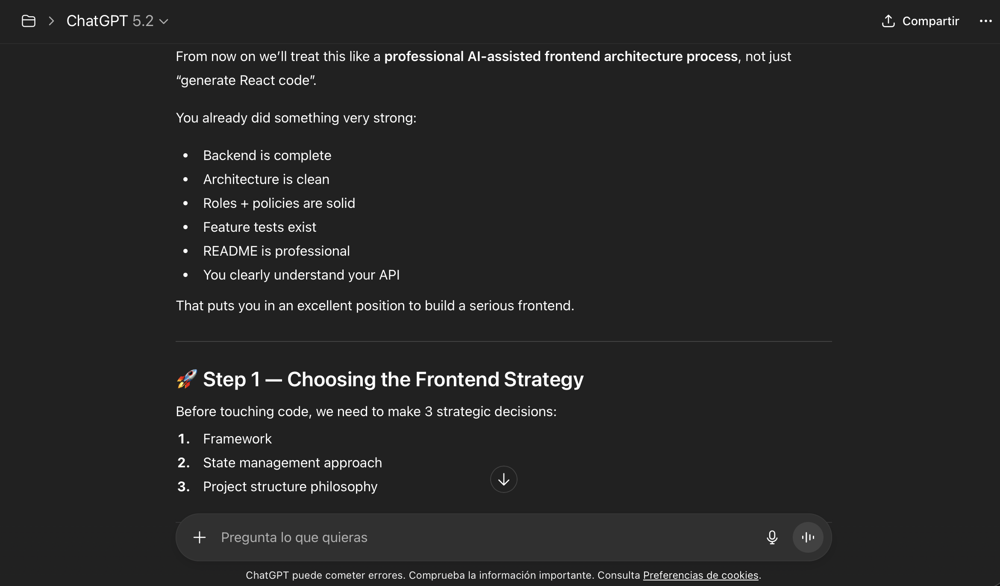
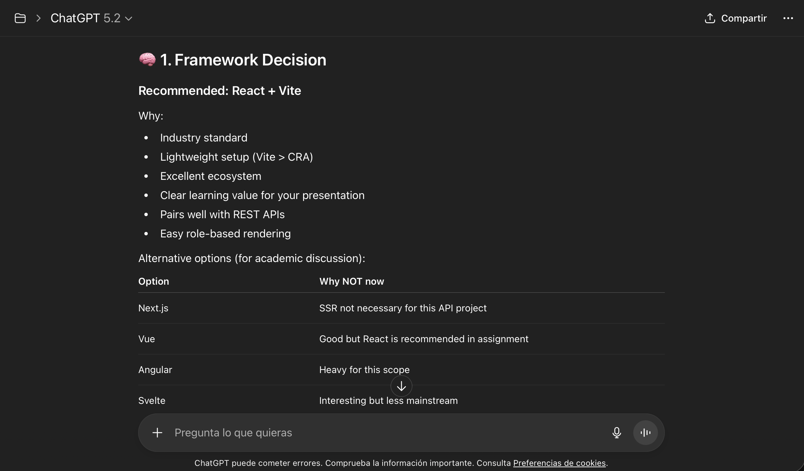
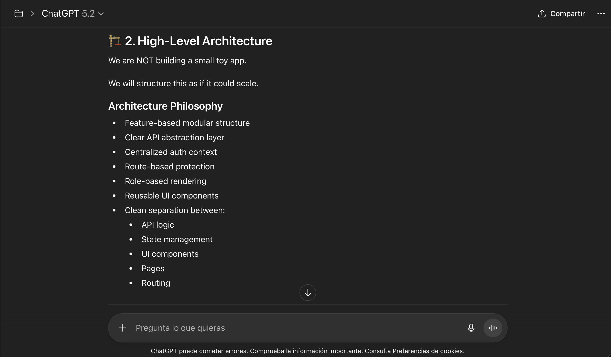
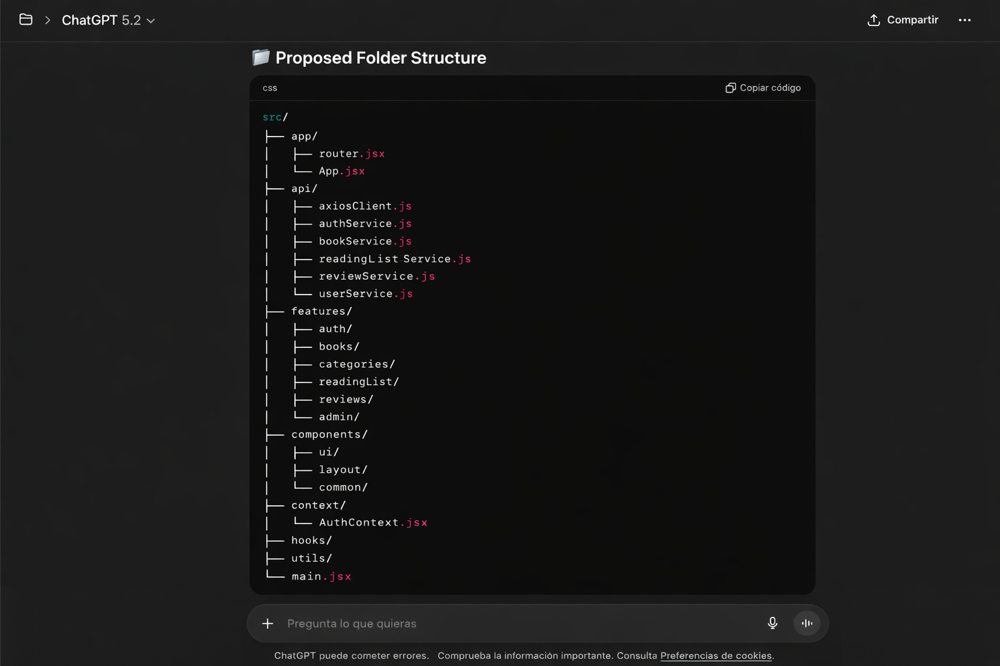
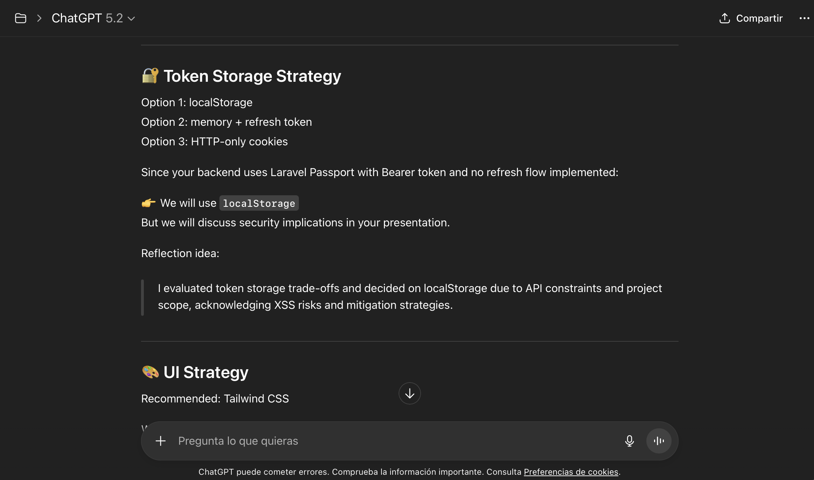
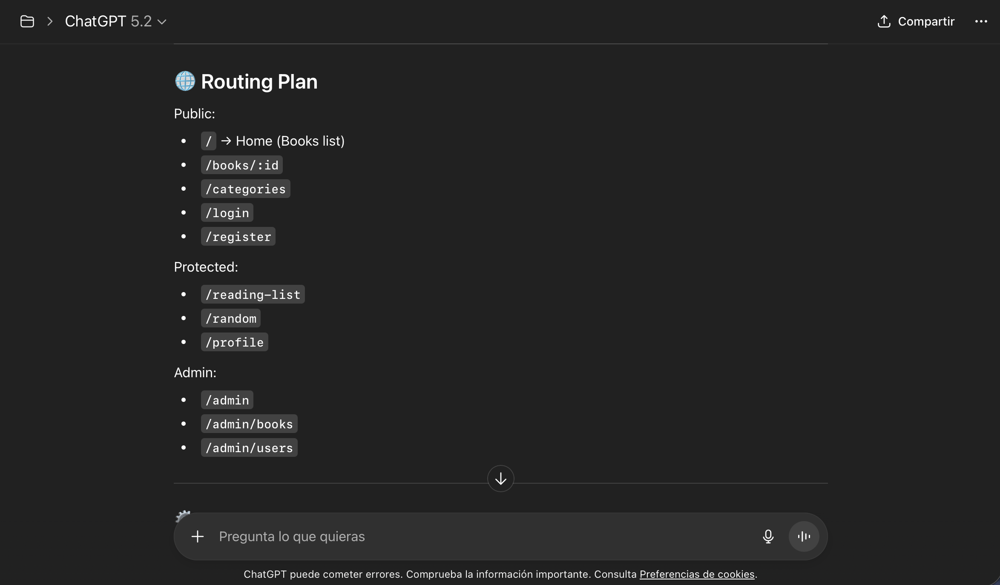
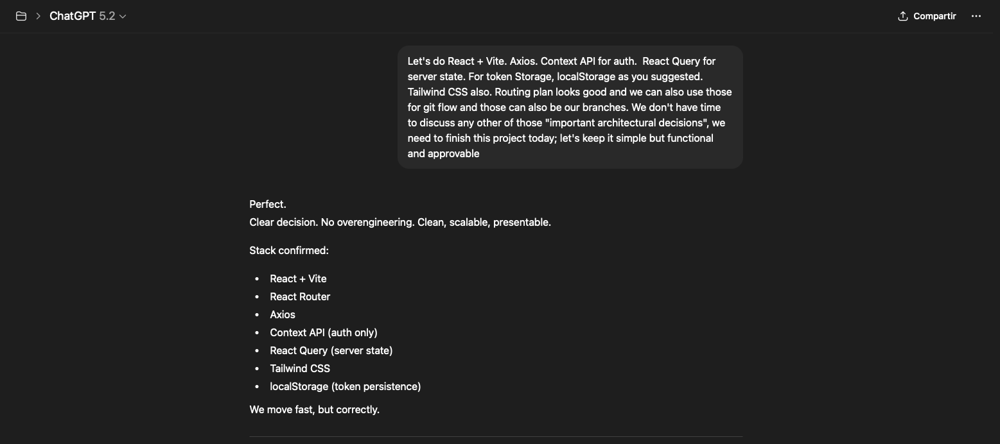
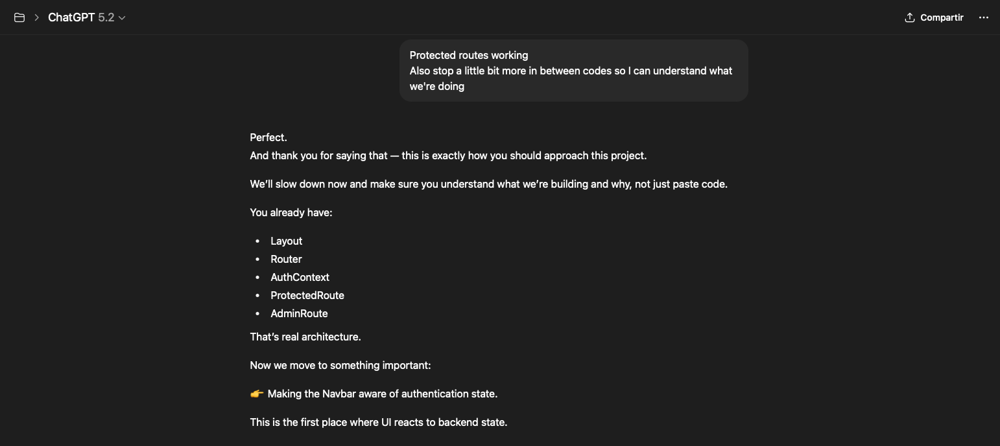

# AI-Assisted Frontend Development Process

To start, I chose ChatGPT for a simple reason, it had a register of our interactions for the whole Sprint 4 and 5, it helped me with the dumpest questions so it knew where my project was going. To start, I asked it to prepare a simple prompt about what it knew about my API, sent the exercise statement and some extra specifications and we got to this prompt, which I sent to a whole new chat (inside the project) so we could start from there, but with the base already strong.

...
I am working on an academic project where I must use an AI model to generate part of a frontend application that consumes a REST API I previously built with Laravel.

This is NOT just about generating code. The goal of the assignment is to deeply understand and analyze the AI-assisted development process.

Here is what I need you to do:

1. Help me design and generate a frontend client that consumes my existing Laravel REST API.
2. Use React (recommended), unless you strongly justify a better alternative for learning purposes.
3. Focus on clean architecture, scalability, and good frontend practices (folder structure, separation of concerns, reusable components, state management, etc.).
4. Explain every architectural decision you make.
5. Do NOT blindly generate everything at once — guide me step-by-step so I can understand and reflect on the process.
6. When generating code, explain why it is written that way and what trade-offs exist.

About my backend:

- Laravel REST API
- Authentication: Laravel Passport (Bearer Token)
- Roles: user and admin
- Endpoints include:
  - Auth (register, login, logout)
  - Books (public listing + detail)
  - Categories
  - Reading List (CRUD + random suggestion)
  - Reviews
  - Admin book and user management

Frontend requirements:

- Public pages: Home (books), Book detail with reviews, Categories
- Auth pages: Login / Register
- Protected pages: Reading List, Random suggestion, Profile
- Admin dashboard (role-based rendering)
- Token persistence (localStorage or better alternative)
- Protected routes
- Proper API client abstraction layer
- Error handling strategy
- Loading states
- Clean UI (you may suggest Tailwind or similar)

Important:

This project requires that I later:
- Present the AI model I used and justify why I chose it
- Show meaningful interaction examples between me and the AI
- Analyze the code generated by the AI
- Explain how frontend and backend were connected
- Reflect on what I learned from the process
- Document everything clearly in the README

So while helping me:
- Be explicit about your reasoning
- Help me understand what you generate
- Occasionally suggest reflection points I could include in my presentation
- Highlight where I should critically evaluate AI-generated code

Start by proposing the frontend architecture and project setup before writing any code.
...

Why this prompt is strategic?
  * Defines academic context
  * Defines pedagogical objective
  * Avoids mass generation without analysis
  * Forces AI to justify decisions
  * Prepares to reflect on the process
  * Demostrates understanding

Starting strong after sending the prompt, I got some validation from the Chat which is probably why it got so popular, it can get a little bit more personal and "close" if you allow it, which is weird if you understand it's a machine but, whatever-
This was the inmediate response after the prompt, defining the bases to start the project:

Something I already knew about working with AI is that you need to be strict and direct about your responses, also you need at least a small knowledge of where you're going and how the project structure is going; if not, the AI will make u even more lost than u already are and you two will be going in circles around the same code for hours...

I also needed, a couple times, to ask it to slow down so I could understand why we were doing what we were doing. It just wanted me to copy the code, no explanation needed, and test it.

I tried to keep my distance, cause, you know, people are getting married to these things but… sometimes we got too excited after two hours trying to figure out why the API wasn’t connecting to the front… I lost my mind a little bit that day…

Thoughts: git flow and git in general are not ChatGPT strengths. Every time I had to merge, push, or change branches I couldn't trust it's steps. Also 90% of the time I had to stop between steps to make commits so I could keep gitflow; it wasn't it's priority.
Also as code analisis most of the code it gave me worked perfectly, having in mind it knew all the other codes involved in other files it did itself. That was a big plus, the chat did the architecture, folder structure, routing plan, etc, and we followed it's plan. But a big issue in this project was getting into a loop whenever the chat would try to fix it's own code cause' it would return an error and it'll take us one hour going through different codes, sometimes the same one it gave me three trials before.